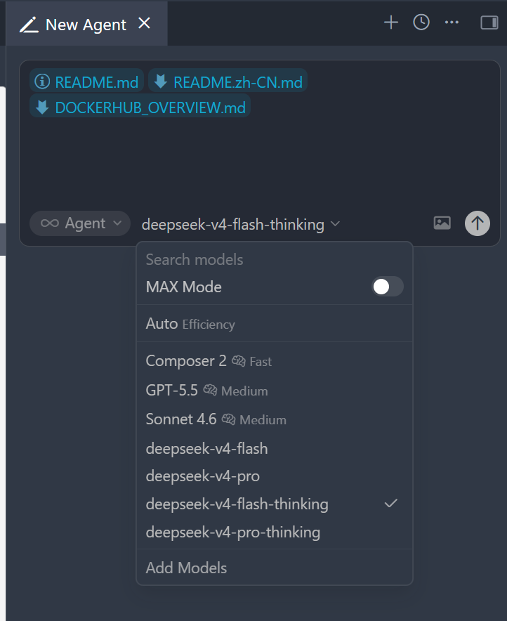

# cursor-deepseek-bridge

[English](./README.md)

一个轻量级 Go 代理，让 [Cursor](https://cursor.com) 通过 OpenAI 兼容接口使用 [DeepSeek V4](https://platform.deepseek.com) 模型（Pro / Flash）。

**Thinking 开关** — 在 Cursor 中只需在模型名后加 `-thinking` 后缀（如 `deepseek-v4-pro-thinking`），代理即可自动开启推理模式，跨多轮对话透明桥接 `reasoning_content` 并自动缓存。同一会话中可自由混用 thinking 和非 thinking 模型。

**图片 OCR** — 当 Cursor 发送图片时，代理自动通过 RapidOCR 进行文字识别，提取的文字传递给 DeepSeek API，让 AI 能"看懂"截图内容。



---

## 核心问题

DeepSeek V4 默认开启 Thinking 模式，每次响应都包含 `reasoning_content`（推理过程）。多轮对话中，客户端需将上一轮的 `reasoning_content` 回传给 API，否则请求会失败。**Cursor 不会自动回传 `reasoning_content`**，导致直接对接 DeepSeek API 时，第二轮及之后的对话会报错。

本代理默认将 `thinking` 设为 `disabled`，解决了 Cursor 与 DeepSeek V4 的兼容性问题。另外，由于 Cursor 的 SSRF 防护禁止使用 `localhost` / `127.0.0.1` 作为 Base URL，代理需要通过公网 HTTPS 地址暴露后才能被访问。

---

## 快速开始

### 1. 获取 DeepSeek API Key

前往 [platform.deepseek.com](https://platform.deepseek.com) 注册并获取 API Key。此 Key 在 Cursor 中配置，代理会透明转发给 DeepSeek。

### 2. 启动代理

**方式 A：本地运行（Go + Python）**

```bash
pip install rapidocr onnxruntime
go run main.go
```

**方式 B：Docker Compose**

```bash
docker compose up -d --build
```

**方式 C：Docker Hub**

```bash
docker run -d --name cursor-deepseek-bridge -p 8080:8080 houzingm/cursor-deepseek-bridge:latest
```

代理默认监听 `0.0.0.0:8080`。

### 3. 暴露到公网

Cursor 无法直接访问本地地址，需通过隧道工具将 8080 端口暴露为 HTTPS：

```bash
# 方式 A：ngrok
ngrok http 8080

# 方式 B：Cloudflare Tunnel
cloudflared tunnel --url http://localhost:8080
```

或使用自有域名 + Nginx 反向代理：

```nginx
server {
    listen 443 ssl;
    server_name your-domain.com;

    ssl_certificate     /path/to/cert.pem;
    ssl_certificate_key /path/to/key.pem;

    location / {
        proxy_pass http://127.0.0.1:8080;
        proxy_set_header Host $host;
        proxy_set_header X-Forwarded-For $proxy_add_x_forwarded_for;
    }
}
```

### 4. 配置 Cursor

| 设置项                    | 填写值                                            |
| ------------------------- | ------------------------------------------------- |
| **OpenAI Base URL** | `https://你的公网地址/v1`（末尾必须有 `/v1`） |
| **API Key**         | 你在 DeepSeek 申请的 API Key                      |
| **Model**           | `deepseek-v4-pro` 或 `deepseek-v4-flash`      |

在模型名后加 `-thinking` 后缀（如 `deepseek-v4-pro-thinking`）即可对该对话启用推理。

---

## 图片 OCR

发送图片时，代理自动：

1. 提取消息中的 base64 图片
2. 使用 [RapidOCR](https://github.com/RapidAI/RapidOCR)（ONNXRuntime 后端）进行文字识别
3. 用识别出的文字（含位置边界框和置信度）替换 `image_url` 内容

**环境要求：**

- **Docker**：OCR 已内置在镜像中
- **本地运行**：需 `pip install rapidocr onnxruntime`
- 自定义 Python 路径：`export PYTHON=/path/to/python`

---

## 高级配置

### 环境变量

| 变量                    | 默认值                       | 说明                                                            |
| ----------------------- | ---------------------------- | --------------------------------------------------------------- |
| `UPSTREAM`            | `https://api.deepseek.com` | 上游 API 地址                                                   |
| `LISTEN`              | `:8080`                    | 代理监听地址                                                    |
| `MAPPED_MODEL`        | `deepseek-v4-pro`          | 未知模型名的默认映射目标                                        |
| `MODEL_MAP`           | （内置映射）                 | 额外自定义映射（`别名=真实模型名`，逗号分隔）                 |
| `DS_REASONING_EFFORT` | `high`                     | `-thinking` 模型的推理深度（`low` / `medium` / `high`） |
| `DS_CACHE_TTL`        | `24h`                      | reasoning 缓存过期时间                                          |
| `DS_QUEUE_TTL`        | `24h`                      | 对话顺序队列过期时间                                            |
| `DS_MAX_REQUEST_BODY` | `32m`                      | 请求体最大大小（最小 1m，最大 256m），发大图时调大              |
| `DS_DEBUG`            | `false`                    | 开启调试日志（设为 `true`）                                   |
| `PYTHON`              | `python`                   | Python 解释器路径（OCR worker 使用）                            |

### 模型映射

代理自动将 Cursor 常见的 OpenAI 模型名映射为 DeepSeek 模型：

| Cursor 模型                                                                                            | 目标模型                                      |
| ------------------------------------------------------------------------------------------------------ | --------------------------------------------- |
| `gpt-4o` / `gpt-4o-mini` / `gpt-4` / `gpt-4-turbo` / `gpt-3.5-turbo` / `chatgpt-4o-latest` | `deepseek-v4-pro`                           |
| `deepseek-v4-pro` / `deepseek-v4-pro-thinking`                                                     | `deepseek-v4-pro`（thinking 禁用 / 启用）   |
| `deepseek-v4-flash` / `deepseek-v4-flash-thinking`                                                 | `deepseek-v4-flash`（thinking 禁用 / 启用） |

自定义映射：

```bash
export MAPPED_MODEL=deepseek-v4-flash
export MODEL_MAP=claude-3-opus=deepseek-v4-pro,gpt-4o=deepseek-v4-flash
```

### Thinking 模式详解

DeepSeek V4 默认开启 Thinking 模式。代理默认对所有请求禁用 `thinking`。如需启用推理：

- 使用带 `-thinking` 后缀的模型名，代理仅对该请求启用 `thinking`
- `reasoning_content` 自动缓存并在多轮对话中桥接
- 目前仅非流式（JSON）响应支持 reasoning 缓存

```bash
# 可选：设置推理深度
export DS_REASONING_EFFORT=high
# 可选：设置缓存过期时间
export DS_CACHE_TTL=1h
```

### 健康检查

```bash
curl http://localhost:8080/healthz
# 返回: ok
```

---

## 许可证

[MIT License](LICENSE)

使用 DeepSeek API 须遵守 [DeepSeek 平台](https://platform.deepseek.com) 使用规范。本项目与 DeepSeek、Cursor 无附属关系。
